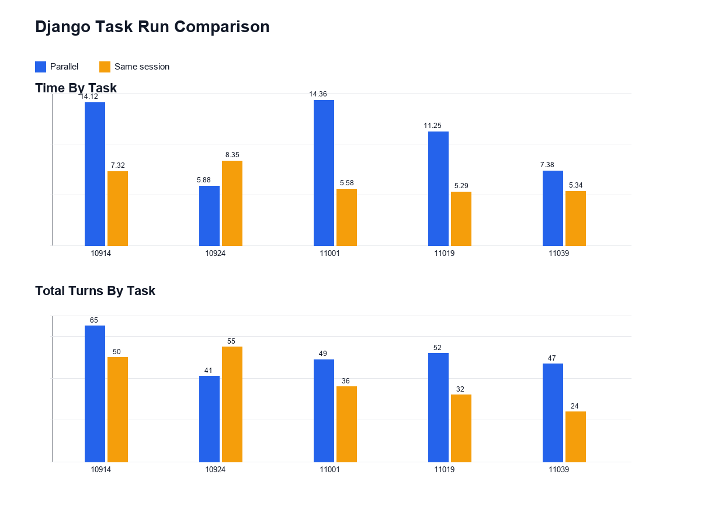

# Django Task Run Comparison

Comparison of `output_logs/parallel/20260429T205202Z` and `output_logs/same_session/20260430T010335Z`.

Task order: `10914`, `10924`, `11001`, `11019`, `11039`.

## Summary

| Metric | Value |
| --- | ---: |
| Parallel wall-clock lower bound | 14.36m |
| Parallel summed task time | 53.00m |
| Same-session summed task time | 31.88m |
| Parallel total turns | 254 |
| Same-session total turns | 197 |
| Turn delta, same minus parallel | -57 |

## Time By Task

| Task | Parallel | Same Session |
| --- | ---: | ---: |
| `django__django-10914` | 14.12m | 7.32m |
| `django__django-10924` | 5.88m | 8.35m |
| `django__django-11001` | 14.36m | 5.58m |
| `django__django-11019` | 11.25m | 5.29m |
| `django__django-11039` | 7.38m | 5.34m |

## Total Turns By Task

| Task | Parallel | Same Session |
| --- | ---: | ---: |
| `django__django-10914` | 65 | 50 |
| `django__django-10924` | 41 | 55 |
| `django__django-11001` | 49 | 36 |
| `django__django-11019` | 52 | 32 |
| `django__django-11039` | 47 | 24 |
