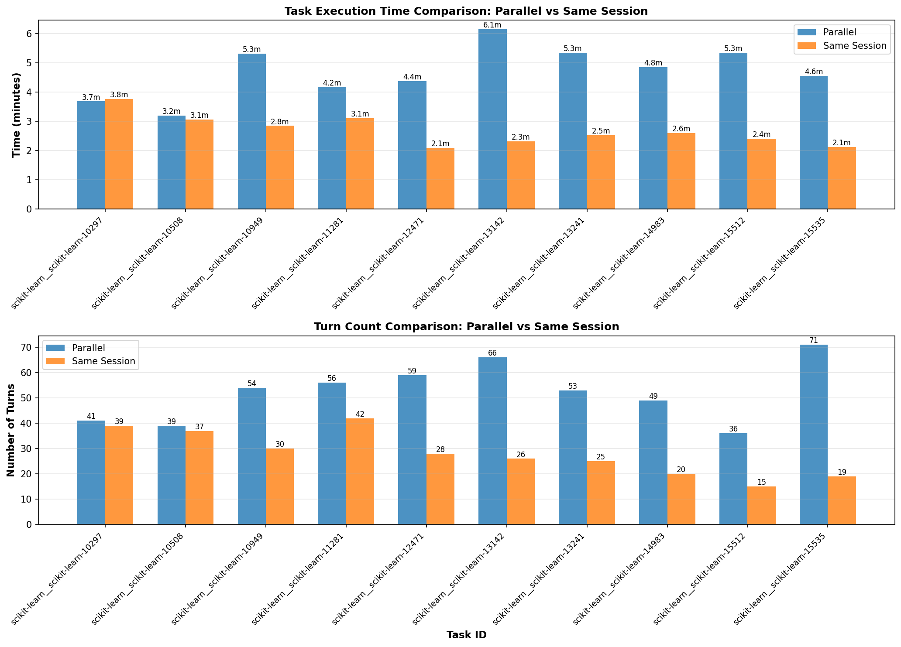

# Scikit-Learn Task Run Comparison

Comparison of parallel runs (10 tasks across `output_logs/parallel/20260430T030135Z`, `20260430T030901Z`, `20260430T032103Z`) and same-session run (`output_logs/same_session/20260430T063815Z`).

Task order: `10297`, `10508`, `10949`, `11281`, `12471`.

## Summary

| Metric | Value |
| --- | ---: |
| Parallel wall-clock lower bound | 6.15m |
| Parallel summed task time | 46.93m |
| Same-session summed task time | 26.82m |
| Parallel total turns | 524 |
| Same-session total turns | 281 |
| Turn delta, same minus parallel | -243 |

## Time By Task

| Task | Parallel | Same Session |
| --- | ---: | ---: |
| `10297` | 3.68m | 3.76m |
| `10508` | 3.20m | 3.06m |
| `10949` | 5.31m | 2.84m |
| `11281` | 4.16m | 3.11m |
| `12471` | 4.37m | 2.09m |
| `13142` | 6.15m | 2.31m |
| `13241` | 5.34m | 2.52m |
| `14983` | 4.84m | 2.59m |
| `15512` | 5.34m | 2.40m |
| `15535` | 4.55m | 2.12m |

## Total Turns By Task

| Task | Parallel | Same Session |
| --- | ---: | ---: |
| `10297` | 41 | 39 |
| `10508` | 39 | 37 |
| `10949` | 54 | 30 |
| `11281` | 56 | 42 |
| `12471` | 59 | 28 |
| `13142` | 66 | 26 |
| `13241` | 53 | 25 |
| `14983` | 49 | 20 |
| `15512` | 36 | 15 |
| `15535` | 71 | 19 |
